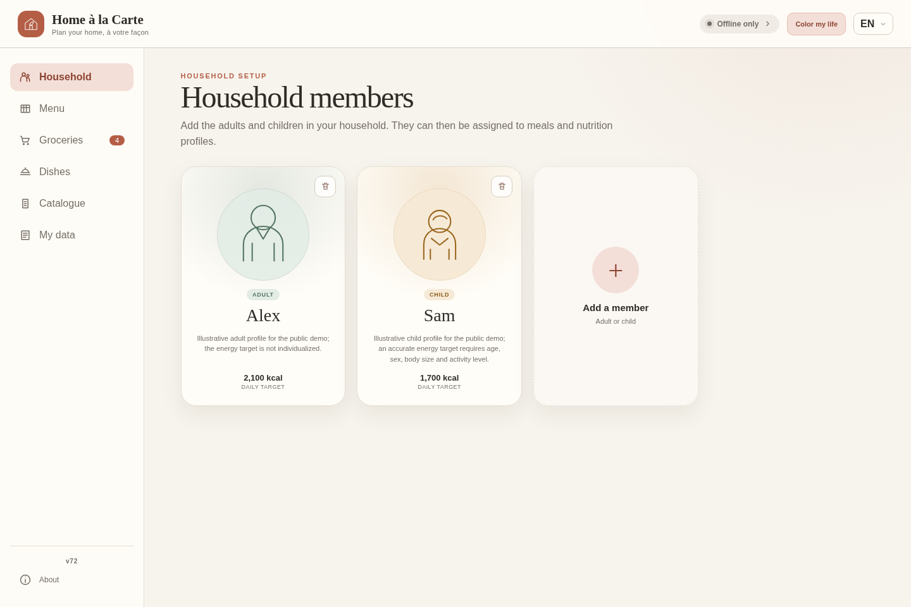
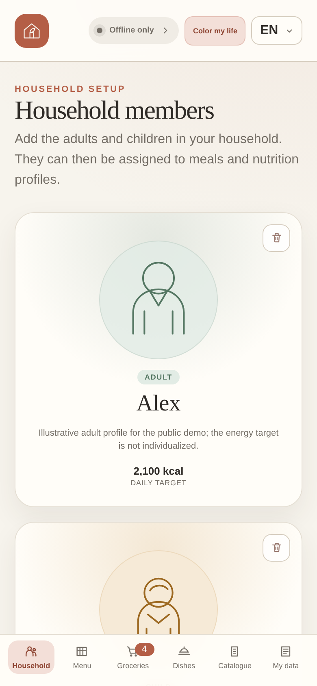

# Home à la Carte

Home à la Carte is an open-source, local-first planner for households, meals,
stock, extra needs, and groceries.

The interface is plain HTML, CSS, and JavaScript. Validation, planning,
nutrition calculations, grocery pricing, and PDF generation run in
Rust/WebAssembly. There is no Node or npm build step.

## Screenshots

These screenshots use the synthetic, non-personal database from
`sample-data/`. Select an image to open it at full size.

### Desktop

<a href="docs/images/homealacarte-demo-desktop.png">
  
</a>

### Mobile

<a href="docs/images/homealacarte-demo-mobile.png">
  
</a>

## Highlights

- visual household profiles for adults and children;
- editable weekly menus with drag-and-drop;
- dishes, recipes, nutrition, price, and Nutri-Score information;
- synchronized grocery requirements and stock;
- additional food or household needs;
- local IndexedDB persistence and offline operation;
- optional Supabase account synchronization;
- deterministic A4 grocery PDFs generated by Rust;
- consolidated JSON import and export;
- French and English interfaces.

## Requirements

- Rust with the `wasm32-unknown-unknown` target;
- `wasm-pack` 0.15 or newer;
- Python 3.

Install `wasm-pack` if necessary:

```bash
cargo install wasm-pack --locked --version 0.15.0
```

## Build and run

The default build uses the synthetic, non-personal files in `sample-data/`:

```bash
make build
make serve
```

Open <http://127.0.0.1:8080>.

To build a private instance from your own ignored `data/` directory:

```bash
make build DATA_DIR=./data
```

`data/`, `dist/`, the generated Wasm package, environment files, and the live
Supabase browser configuration are ignored. Never publish a private `dist/`:
it contains a copy of whichever data directory was selected during the build.

The safer personal-data workflow keeps private information out of static build
assets. Convert and validate the ignored `perso-data/` directory locally:

```bash
make personal-data
```

This writes `private-import/homealacarte.json`, which is also ignored. Import
that file once from the Data page, then use local IndexedDB storage or sign in
to synchronize it through the private Supabase account. The converter accepts
the legacy `ingredients`, `household_items`, `household_needs`, and
`household_stock` sections and validates the consolidated result with the same
Rust engine used by the website. Stock and extra-needs `notes` are retained in
the current schema and survive later quantity edits.

To merge a richer old database with the CIQUAL and receipt updates in
`perso-data/` without modifying either source:

```bash
make merge-personal-data
```

The merge uses `dataweb/` as its base and fills missing fields from
`perso-data/`. Items and dishes remain unique by key; price observations from
both sources become a deduplicated history; menu rows become an exact union;
and matching stock or extra-needs quantities are added together with their
notes. Populated non-mergeable base values are preserved and recorded as
conflicts. The command writes the ignored
`private-import/homealacarte-merged.json` plus a complete ignored audit at
`private-import/homealacarte-merge-audit.json`.

## Data format

The current consolidated schema has these top-level collections:

- `items`: food ingredients and general household items;
- `dishes`: recipes composed from food items;
- `people`: household members;
- `menu`: scheduled food or dishes;
- `stock`: quantities currently available;
- `extra_needs`: requirements not generated by the menu.

Food and household items retain a `price_history` list. Each observation has a
`date`, numeric `price`, and free-text `description`; food prices are per
kilogram and household prices are per purchase unit. The existing current-price
fields remain available for planning and are selected from the latest dated
observation during a merge.

When an observation comes from an actual purchase, its optional `purchase`
object stores the structured `quantity`, `unit`, and `total_paid` values, plus
an optional `store` and `purchase_id`. These values are not encoded in the
free-text description.

Food items include nutrition and gram-conversion fields. General items may omit
nutrition. Imports are strict and reject obsolete or unknown structures.

Automatic Nutri-Score uses the updated 2023 general-food algorithm. A dish is
calculated when every ingredient provides `sugars_g`, `saturated_fat_g`,
`salt_g`, and `fruit_vegetable_legume_percent`, in addition to the existing
energy, protein, and fibre values. Missing fields remain absent rather than
being treated as zero, and the interface reports both ingredient-level and
dish-level completeness. A manually supplied dish `nutri_score` is retained as
a fallback until automatic calculation becomes possible. The special
algorithms for beverages and for fats, oils, nuts, and seeds are not applied.

Dish components can use grams:

```json
{"item_key": "flour", "grams": 250}
```

They can also use the item's declared measure unit:

```json
{"item_key": "onion", "quantity": 1, "quantity_unit": "piece"}
```

## Architecture

```text
HTML + CSS + JavaScript
          |
       Web Worker
          |
   Rust / WebAssembly
          |
 validation · planning · PDF

IndexedDB document <-> optional versioned Supabase/Postgres document
```

### Server-coordinated synchronization

JSON is both the portable import/export format and the synchronization boundary.
IndexedDB keeps an offline household document while Supabase stores one
server-versioned document per account. An atomic database function serializes
writes and applies compare-and-set revision checks, so identity and concurrency
control stay on the server instead of leaking generated IDs into menu data.

Run [`supabase/schema.sql`](supabase/schema.sql) in the Supabase SQL editor
before deploying a build that uses document synchronization. The schema
idempotently folds an existing relational replica into `household_state`, and
the browser likewise converts an existing IndexedDB row replica back into a
document. Legacy menu `id` fields are accepted but removed during normalization
and are never emitted by current exports.

Concurrent writes use the document revision and present the existing
local/online choice when both devices changed. All save, poll, focus, reconnect,
and manual requests pass through one coalescing synchronization queue. The
server document is checked about every 30 seconds while the page is visible;
focus and reconnect also request a sync. Remote updates are rehydrated into the
existing worker without reloading the page, and JSON objects are compared
semantically so property ordering cannot create false conflicts.

The IndexedDB replica records its owning account. If a different account signs
in on the same browser profile, synchronization and local writes stop with an
explicit error instead of uploading the previous account's data.

## Validation

```bash
make test
make build
make release-check
```

`release-check` rejects tracked private/generated directories, credential-shaped
values, and private data paths found in the current branch history.

## GitHub Pages

The `Home à la Carte — checks and GitHub Pages` workflow tests every pull
request. A push to `main`, or a manual run on `main`, additionally builds the
synthetic public dataset and deploys `dist/` to GitHub Pages.

Before the first deployment, configure the repository:

1. In **Settings → Pages → Build and deployment**, select **GitHub Actions**.
2. In **Settings → Secrets and variables → Actions → Variables**, add
   `SUPABASE_PROJECT_URL`.
3. In **Settings → Secrets and variables → Actions → Secrets**, add
   `SUPABASE_PUBLISHABLE_KEY`.
4. In **Supabase → Authentication → URL Configuration**, set the production
   Site URL to `https://bbodin.github.io/homealacarte/` and add the same address
   to the allowed redirect URLs. Keep the local address as an additional
   redirect only while the private Mac deployment is still used.

Although the Supabase publishable key is designed for browser use, storing it as
a repository secret prevents it from appearing directly in the workflow source.
The generated site necessarily contains it; database protection comes from
Supabase Authentication and RLS, never from hiding that browser key.
